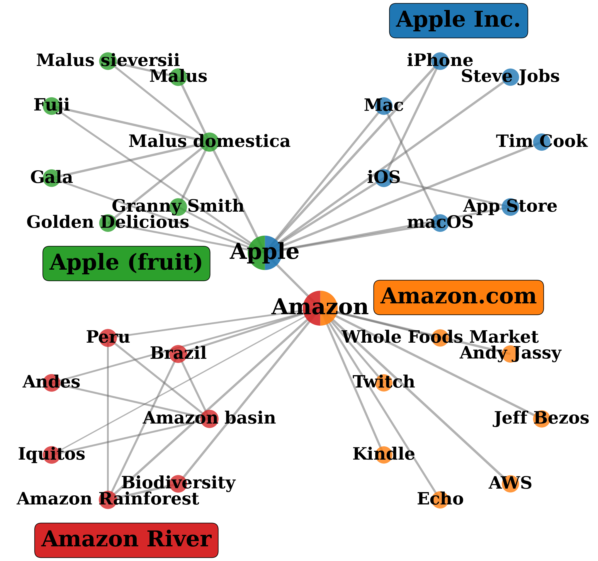
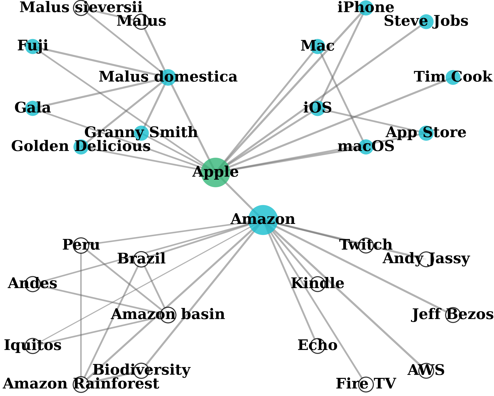
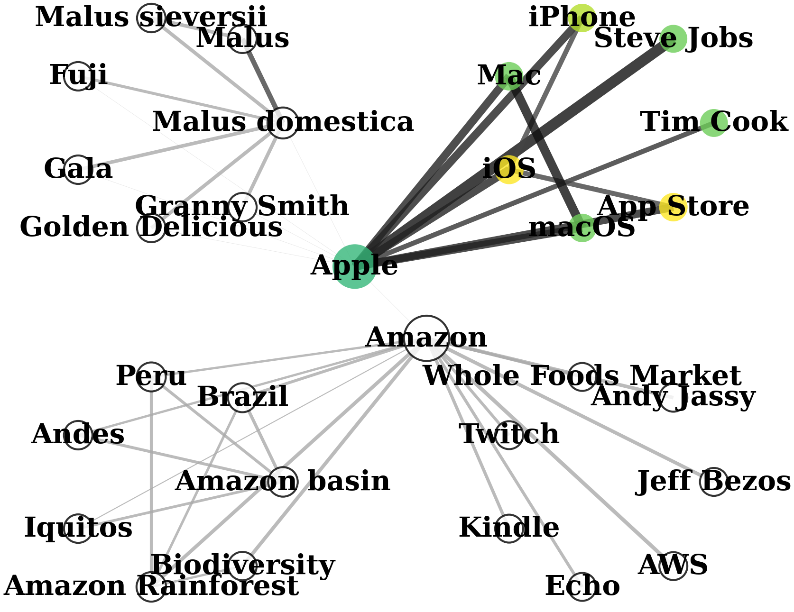

# QAFD-RAG

Official code for the paper:

**[Query-Aware Flow Diffusion for Graph-Based RAG with Retrieval Guarantees](https://openreview.net/forum?id=n28wnc2QTc)**
*Zhuoping Zhou, Davoud Ataee Tarzanagh, Sima Didari, Wenjun Hu, Baruch Gutow, Oxana Verkholyak, Masoud Faraki, Heng Hao, Hankyu Moon, Seungjai Min*
**ICLR 2026**

QAFD-RAG uses **query-aware flow diffusion** to retrieve contextually relevant subgraphs from a knowledge graph. Unlike community-based (GraphRAG) or entity-centric (LightRAG) approaches, QAFD-RAG dynamically re-weights edges based on query relevance and propagates flow through the graph to discover multi-hop context with retrieval guarantees.

<table align="center"><tr>
  <td align="center"><br/><em>GraphRAG</em></td>
  <td align="center"><br/><em>LightRAG</em></td>
  <td align="center"><br/><em>QAFD-RAG</em></td>
</tr></table>

## Quick Start

```bash
# 1. Create conda environment and install dependencies
conda create -n qafd-rag python=3.10 -y
conda activate qafd-rag
pip install -r requirements.txt

# 2. Set your OpenAI API key (required for default embedding and LLM)
export OPENAI_API_KEY="sk-..."

# 3. Run a benchmark (KG is auto-built on first run)
python benchmarks/run.py --task multihop --dataset musique --questions 10
python benchmarks/run.py --task ultradomain --dataset mix --questions 10
```

> **Note:** The default embedding model is `openai-small` (OpenAI text-embedding-3-small) and the default LLM is `gpt-4o-mini`. Both require `OPENAI_API_KEY`. To use free local embeddings instead, see [Local Embedding Models](#local-embedding-models).

## Two Graph Types

QAFD-RAG supports two knowledge graph representations, both using the same Query-Aware Flow Diffusion algorithm:

| | **Entity Graph** | **Passage-Entity Graph** |
|---|---|---|
| **Nodes** | Entities + relationships | Entities + passages + facts |
| **Extraction** | LLM entity/relationship extraction | OpenIE (NER + triple extraction) ([HippoRAG 2](https://arxiv.org/abs/2405.14831)) |
| **Edges** | Entity-entity relationships | Fact edges + passage edges + synonymy edges |
| **QAFD traversal** | Flow reaches entities, passages looked up after | Flow reaches passages directly as graph nodes |
| **Best for** | General QA, text2sql, summarization | Multi-hop reasoning |
| **Default tasks** | ultradomain, text2sql, summarization | multihop |

Both graph types use query-aware flow diffusion with the same parameters (alpha=2.0, epsilon=0.01, step_size=0.2).

## Project Structure

```
QAFD-RAG/
├── benchmarks/
│   ├── run.py                       # Unified benchmark runner (--graph_type, --task)
│   ├── multihop/                    # Multi-hop reasoning
│   ├── ultradomain/                 # General domain QA
│   ├── text2sql/                    # Natural language to SQL
│   └── summarization/               # Document summarization
├── src/
│   ├── QAFD_RAG.py                  # Entity graph pipeline (main class)
│   ├── base.py                      # Storage interfaces, QueryParam
│   ├── llm.py                       # LLM and embedding functions
│   ├── storage.py                   # KV, vector, and graph storage
│   ├── operate.py                   # Query operations
│   ├── evaluation.py                # Answer evaluation
│   ├── answering/                   # Query processing (entity graph)
│   │   ├── handler.py               # kg_query entry point
│   │   ├── context.py               # Context building (local/global/hybrid)
│   │   ├── clusters.py              # Flow diffusion clustering
│   │   └── text_units.py            # Text chunk retrieval
│   ├── retrievers/
│   │   ├── flow_diffusion.py        # QAFD on NetworkX (entity graph)
│   │   └── base.py                  # Retriever interface
│   ├── hipporag_pipeline/           # Passage-entity graph pipeline
│   │   ├── kg_builder.py            # OpenIE → igraph (entities + passages + facts)
│   │   ├── graph_adapter.py         # QAFD on igraph (passage-entity graph)
│   │   ├── retriever.py             # Fact reranking → seed selection → QAFD
│   │   ├── config.py                # Pipeline configuration
│   │   ├── openie.py                # NER + triple extraction
│   │   ├── embedding_store.py       # Parquet-backed vector store
│   │   ├── reranker.py              # LLM-based fact reranker
│   │   ├── prompts.py               # Prompt templates
│   │   ├── benchmark_runner.py      # Standalone runner
│   │   └── utils.py                 # Helpers
│   ├── indexing/                     # KG construction (entity graph)
│   │   ├── chunkers.py              # Token-based chunking
│   │   ├── extractors.py            # Entity/relationship extraction
│   │   ├── schema_builder.py        # Database schema KG builder
│   │   └── build_kg.py              # CLI KG builder
│   ├── embedding_models/            # Embedding model implementations
│   ├── prompts/                     # LLM prompt templates
│   ├── text2sql/                    # Text-to-SQL support
│   └── utils/                       # Helpers
├── data/                            # Datasets (auto-downloaded from HuggingFace)
├── kg/                              # Knowledge graphs (auto-generated or downloaded)
├── docs/figs/                       # Figures for README
├── ICLR2026/                        # Paper source (LaTeX)
└── results/                         # Benchmark results (JSON)
```

## Benchmarks

| Task | Datasets | Metrics |
|------|----------|---------|
| **UltraDomain** | agriculture, biology, cs, finance, legal, math, medicine, mix, music, philosophy, physics | Quality scores (comprehensiveness, diversity, relevance, logicality, coherence) |
| **Multi-hop QA** | MuSiQue, HotpotQA, 2WikiMultiHopQA | F1, Exact Match |
| **Text-to-SQL** | Spider2-lite, Bird | Schema retrieval precision/recall |
| **Summarization** | SQuALITY | BLEU, ROUGE, METEOR, quality scores |

## Usage

### Unified Benchmark Runner

```bash
python benchmarks/run.py --task <task> --dataset <dataset> [options]
```

The runner automatically selects the appropriate graph type (passage-entity for multihop, entity for others). Override with `--graph_type`:

```bash
# Multihop with passage-entity graph (default)
python benchmarks/run.py --task multihop --dataset musique --questions 100

# Multihop with entity graph (override)
python benchmarks/run.py --task multihop --dataset musique --graph_type entity

# Ultradomain
python benchmarks/run.py --task ultradomain --dataset mix --questions 10

# Retrieval only (skip QA)
python benchmarks/run.py --task multihop --dataset musique --skip_qa

# Build KG only
python benchmarks/run.py --task multihop --dataset musique --build_only
```

### Legacy CLI

All benchmarks can also be run through `./run.sh`:

```bash
./run.sh <task> [options]
```

### Knowledge Graphs

KGs are **auto-generated on first run** if not present. To skip building, download pre-built KGs from [huggingface.co/datasets/qafd/kg](https://huggingface.co/datasets/qafd/kg):

```bash
# Download a single KG to test (recommended for first-time setup)
huggingface-cli download qafd/kg --repo-type dataset \
    --include "ultradomain/gpt-4o-mini_openai-small_mix/*" --local-dir ./kg

# Download all KGs for one benchmark
huggingface-cli download qafd/kg --repo-type dataset --include "multihop/*" --local-dir ./kg
huggingface-cli download qafd/kg --repo-type dataset --include "ultradomain/*" --local-dir ./kg
huggingface-cli download qafd/kg --repo-type dataset --include "text2sql/*" --local-dir ./kg

# Download everything
huggingface-cli download qafd/kg --repo-type dataset --local-dir ./kg
```

### Run Benchmarks

```bash
# Multi-hop QA
python benchmarks/run.py --task multihop --dataset musique --questions 100
python benchmarks/run.py --task multihop --dataset hotpotqa --questions 100
python benchmarks/run.py --task multihop --dataset 2wikimultihopqa --questions 100

# UltraDomain
python benchmarks/run.py --task ultradomain --dataset mix --questions 10

# Text-to-SQL
python benchmarks/run.py --task text2sql --dataset spider2-lite

# Summarization
python benchmarks/run.py --task summarization --dataset narrativeqa
```

### Common Options

| Option | Description |
|--------|-------------|
| `--task TASK` | `multihop`, `ultradomain`, `text2sql`, `summarization` |
| `--dataset NAME` | Dataset name (e.g., `musique`, `mix`, `spider2-lite`) |
| `--graph_type TYPE` | `passage-entity` or `entity` (auto-selected by task) |
| `--questions N` | Number of questions to evaluate |
| `--build_only` | Build KG only, skip benchmark |
| `--force_build` | Rebuild KG even if it exists |
| `--skip_qa` | Run retrieval only, skip QA (passage-entity) |
| `--embedding MODEL` | Embedding model (see table below) |
| `--llm MODEL` | LLM model (`gpt-4o-mini`, `gpt-4o`, `gpt-5-nano`, `gpt-5-mini`, `gpt-5`, `gpt-oss-120b`) |
| `--alpha FLOAT` | QAFD alpha parameter (default: 2.0) |
| `--epsilon FLOAT` | QAFD convergence threshold (default: 0.01) |
| `--weight_scheme` | Query-aware edge weighting: `original`, `multiply`, `add` |

## Data

Datasets are automatically downloaded from HuggingFace on first run:

| Task | Source | Reference |
|------|--------|-----------|
| **UltraDomain** | [TommyChien/UltraDomain](https://huggingface.co/datasets/TommyChien/UltraDomain) | agriculture, biology, cs, finance, legal, math, medicine, mix, music, philosophy, physics |
| **Multi-hop QA** | [osunlp](https://huggingface.co/osunlp) | MuSiQue, HotpotQA, 2WikiMultiHopQA |
| **Summarization** | [pszemraj/SQuALITY-v1.3](https://huggingface.co/datasets/pszemraj/SQuALITY-v1.3) | SQuALITY |
| **Text-to-SQL** | Included (`data/text2sql/`) | Spider2-lite (Pagila) + Bird (superhero) with auto-generated DB summaries |

## Configuration

### Embedding Models

| Key | Model | Dimensions |
|-----|-------|-----------|
| `openai-small` | text-embedding-3-small | 1536 |
| `openai-large` | text-embedding-3-large | 3072 |
| `jina-v3` | jinaai/jina-embeddings-v3 | 1024 |
| `gritlm` | GritLM/GritLM-7B | 4096 |
| `nvidia-nv-embed-v2` | nvidia/NV-Embed-v2 | 4096 |

The default embedding is **`openai-small`** which requires `OPENAI_API_KEY`.

Use `--embedding <key>` to select a model:

```bash
./run.sh ultradomain --questions 10 --embedding jina-v3
```

### Local Embedding Models

Local embeddings (`jina-v3`, `gritlm`, `nvidia-nv-embed-v2`) run on your GPU and do not require an API key for embeddings. They are downloaded automatically from HuggingFace on first use.

**Requirements:**
- CUDA-capable GPU with sufficient VRAM (8GB+ recommended)
- Models are cached in `~/.cache/huggingface/`

**Usage with local embeddings (no OpenAI API needed for embeddings):**

```bash
# Use Jina v3 (1024-dim, lightweight, good quality)
./run.sh ultradomain --questions 10 --embedding jina-v3

# Use GritLM (4096-dim, unified embedding+generation)
./run.sh multihop --dataset musique --questions 10 --embedding gritlm

# Use NVIDIA NV-Embed-v2 (4096-dim, 32K context, high quality)
./run.sh ultradomain --questions 10 --embedding nvidia-nv-embed-v2
```

> **Note:** Even with local embeddings, an LLM API key is still required for entity extraction (KG building) and answer generation. Set `OPENAI_API_KEY` or use `--llm gpt-oss-120b` for a free open-source LLM.

### LLM Models

`gpt-4o-mini` (default), `gpt-4o`, `gpt-5-nano`, `gpt-5-mini`, `gpt-5`, `gpt-oss-120b` (free, local)

## Python API

```python
from src import QAFD_RAG, QueryParam

# Initialize
rag = QAFD_RAG(
    working_dir="./my_kg",
    llm_model_name="gpt-4o-mini",
    embedding_model_key="jina-v3",
)

# Index documents
rag.insert(["Document text 1...", "Document text 2..."])

# Query
answer = rag.query(
    "What is X?",
    param=QueryParam(mode="hybrid"),
)
print(answer)
```

### QueryParam Options

| Parameter | Default | Description |
|-----------|---------|-------------|
| `mode` | `"hybrid"` | Retrieval mode: `local`, `global`, `hybrid` |
| `top_k` | 40 | Number of entities to retrieve |
| `max_source_nodes` | 40 | Max source nodes for flow diffusion |
| `min_flow_threshold` | 0.1 | Minimum flow value to include a node |
| `enable_query_aware_flow_diffusion` | `True` | Use query-aware edge weighting |
| `alpha` | 50.0 | Flow diffusion initialization factor |
| `response_type` | `"Multiple Paragraphs"` | Output format |

## How It Works

QAFD-RAG processes documents through a two-stage pipeline:

**Stage 1 -- Knowledge Graph Construction**

*Entity Graph:*
1. Documents are split into token-based chunks.
2. An LLM extracts entities and relationships from each chunk.
3. Entities become nodes, relationships become weighted edges.

*Passage-Entity Graph:*
1. Documents are split into passages (chunks).
2. OpenIE extracts named entities and (subject, predicate, object) triples.
3. Entities and passages are both graph nodes, connected by fact edges, passage-entity edges, and synonymy edges (entity pairs with cosine similarity > 0.8).

**Stage 2 -- Query-Aware Flow Diffusion**

1. **Seed Selection**: Query is matched to entities/facts via embedding similarity. An LLM reranker filters the most relevant facts.
2. **Flow Diffusion**: Mass is injected at seed nodes and propagated through the graph via push-relabel. Edge weights are dynamically adjusted based on each node's similarity to the query.
3. **Passage Ranking**: Nodes accumulate importance scores proportional to flow. In the passage-entity graph, passages are ranked directly. In the entity graph, associated text chunks are retrieved from top-ranked entities.
4. **LLM Answering**: Top passages are assembled into context and passed to an LLM for answer generation.

The flow diffusion algorithm is the key differentiator: rather than simple graph traversal or vector search alone, it combines graph structure with query relevance to find contextually important information that may be several hops away from the initial match.
